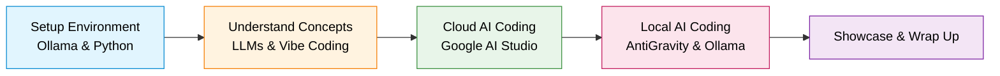
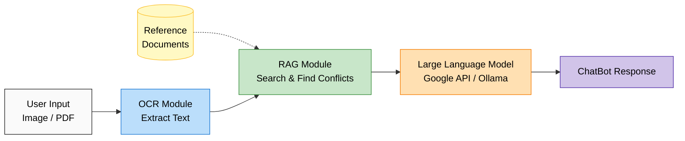

# AI Hands-on Course: Beginner's Lecture Notes

Welcome to the AI Hands-on Course! This document will serve as your guide and lecture notes for today's session. It is designed to help you follow along with the schedule and track your progress.

---

## 📅 Schedule at a Glance

| Time | Session | Key Activities |
| :--- | :--- | :--- |
| **10:30 - 10:40** | **1. Check Dev Environment** | Setup Ollama, Qwen3.5, and test Python code. |
| **10:40 - 10:55** | **2. Overview** | LLM evolution, Document formats, Vibe Coding. |
| **10:55 - 11:40** | **3. Vibe Coding via Google AI Studio**| Build ChatBot, add OCR, implement RAG. |
| **11:40 - 14:00** | **Lunch Break** | Rest and recharge! |
| **14:00 - 14:45** | **4. Vibe Coding via AntiGravity** | MD/PDF conversion, ChatBot with Ollama & RAG. |
| **15:00 - 15:25** | **5. Showcase** | Present apps, Wrap up. |

---

## 🗺️ Course Flow & Architecture

### Overall Course Progression

### ChatBot Application Architecture
*This diagram shows the core system we will be building and upgrading throughout the day:*

---

## 1. Check Development Environment

**10:30 | 1.1. Ollama + Qwen3.5:0.8b => Try to Chat**
*   **Goal:** Ensure your local AI model is running properly.
*   **Notes:** We will use Ollama to run the Qwen 3.5 (0.8 billion parameters) model locally. 

> **Vibe Prompt:**
> *"Hi Qwen! Can you explain what a large language model is in one simple sentence?"*

**10:35 | 1.2. AntiGravity + Python => Try to Create & Execute Python Code**
*   **Goal:** Verify our Python coding environment.
*   **Notes:** We'll use our AI assistant to write a quick Python script that plots sinusoidal signals.

> **Vibe Prompt:**
> *"Write a Python script using matplotlib that plots two sinusoidal signals with different frequencies on the same graph. Save the result as an image file."*

---

## 2. Overview

**10:40 | 2.1. Evolution of Large Language Models**
*   **Concepts:** How did we get from early AI to modern LLMs? We'll briefly cover the timeline.

**10:45 | 2.2. Comparison of Document Formats: docs vs. pdf vs. md**
*   **Concepts:** Why are we using Markdown (`.md`) today? It's lightweight, easy for AI to read, and great for software development.

**10:50 | 2.3. Understanding of Vibe Coding**
*   **Concepts:** What is "Vibe Coding"? It's the modern process of guiding an AI to write code for you through natural language conversation, focusing on the "vibe" or intention rather than exact syntax.

---

## 3. Vibe Coding via Google AI Studio

**10:55 | 3.1. Create Google API Key**
*   **Action:** Go to Google AI Studio and generate your personal API key. *Keep this secret and never share it!*

**11:00 | 3.2. Build a ChatBot App**
*   **Action:** We will build our first simple ChatBot application using the Google API.

> **Vibe Prompt:**
> *"Build a simple ChatBot web app using Python and Streamlit. It should connect to the Google Gemini API, take text input from the user, and display the AI's response in a chat interface."*

**11:20 | 3.3. Upgrade the ChatBot App: OCR**
*   **Action:** Adding Optical Character Recognition (OCR). We will make our app able to "read" text from clipboard images, uploaded images, or PDFs.

> **Vibe Prompt:**
> *"Upgrade my existing Streamlit ChatBot to accept image uploads (PNG, JPG) and PDF files. Use the Google Gemini Vision API to extract text from these files so I can ask questions about the visual content."*

**11:40 | 3.4. Upgrade the ChatBot App: Retrieval-Augmented Generation (RAG)**
*   **Action:** RAG gives AI a memory! We will use it to help our bot find specific information from documents.

> **Vibe Prompt:**
> *"Add a Retrieval-Augmented Generation (RAG) feature to my Streamlit app. When I upload multiple documents, it should process them so I can ask 'Are there any conflicting statements between these documents?' Please highlight and cite the conflicts."*

---

*Lunch Break*

---

## 4. Vibe Coding via AntiGravity

**14:00 | 4.1. Create Document Conversion Functions**
*   **Action:** Write Python functions to easily convert Markdown files to PDFs, and PDFs to Markdown.

> **Vibe Prompt:**
> *"Write two Python functions: one that converts a Markdown file into a well-formatted PDF, and another that reads a PDF and converts its text back into Markdown format. Include a simple script to test them."*

**14:15 | 4.2. Build a ChatBot App based on Google API**
*   **Action:** Building our ChatBot again, this time utilizing the AntiGravity interface.

> **Vibe Prompt:**
> *"Using the AntiGravity AI assistant, help me write a new Streamlit ChatBot app from scratch. Set up the basic layout, chat history, and connect it to Google's API to answer questions."*

**14:25 | 4.3. Upgrade the ChatBot App: OCR based on Google API**
*   **Action:** Implementing Google API's advanced vision capabilities for OCR.

> **Vibe Prompt:**
> *"Update the ChatBot we just built to include a file uploader on the sidebar. If an image is uploaded, use the Google Vision API to read the text and summarize what it sees in the chat."*

**14:35 | 4.4. Upgrade the ChatBot App: LLM & OCR based on Ollama API**
*   **Action:** Switching our backend! We will now use the local Ollama model instead of the cloud API.

> **Vibe Prompt:**
> *"Refactor my Streamlit ChatBot code. Remove the Google API dependencies and replace them with calls to my local Ollama instance running the 'qwen3.5:0.8b' model for both text generation and image analysis."*

**14:45 | 4.5. Upgrade the ChatBot App: Retrieval-Augmented Generation**
*   **Action:** Implementing RAG again to find conflicting contents using our local tools.

> **Vibe Prompt:**
> *"Implement a RAG pipeline in my Ollama-powered ChatBot using a local vector database like ChromaDB. I want to upload two different text files and ask the ChatBot to find and explain any contradictory information between them."*

---

## 5. Showcase

**15:00 | 5.1. Introduce your app via Google Meet**
*   **Action:** Time to show off what you've built! Share your screen and demonstrate your working ChatBot to the class.

**15:25 | 5.2. Wrap up**
*   **Notes:** Q&A, final thoughts, and resources for continued learning. Congratulations on completing the course!
